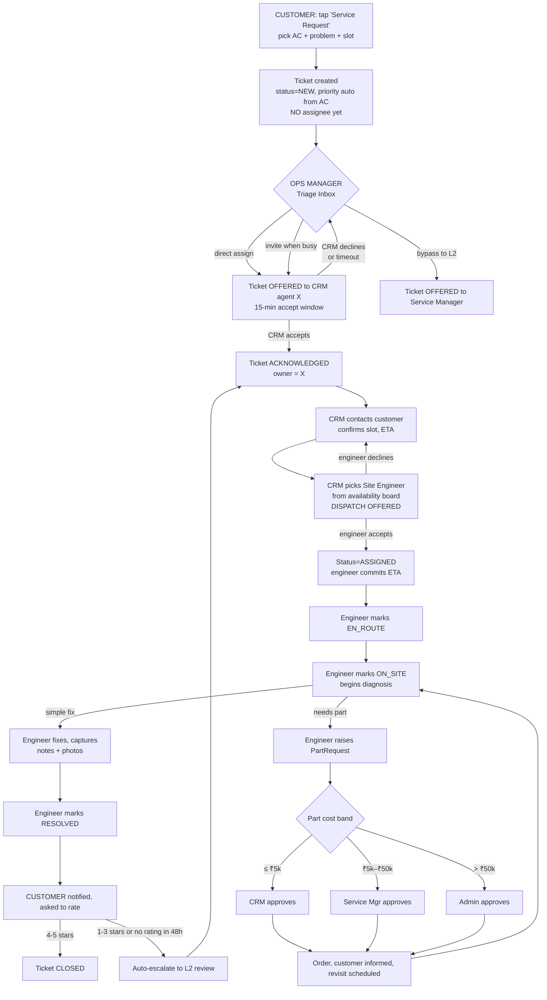
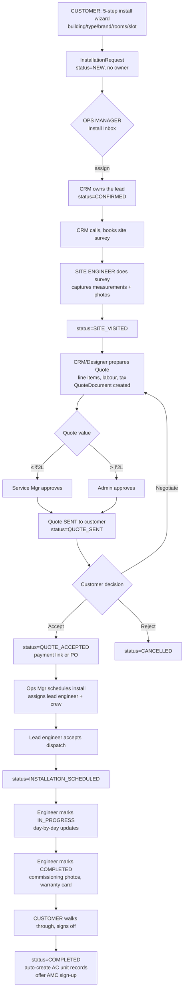
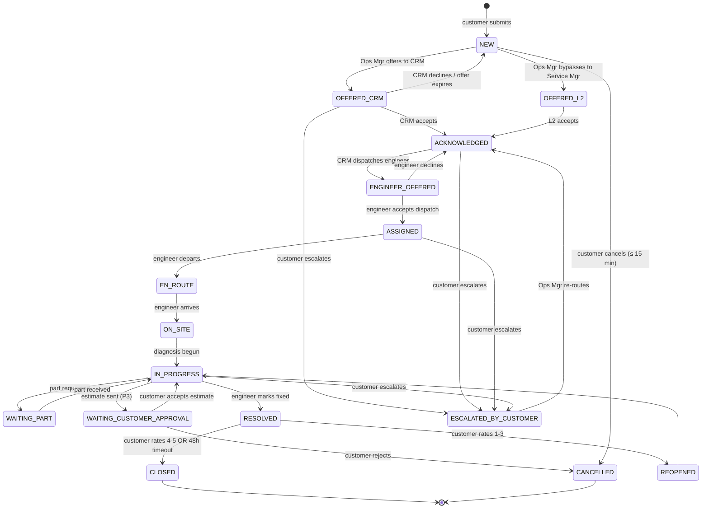
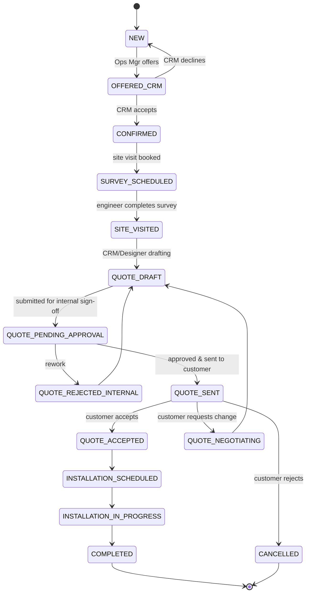
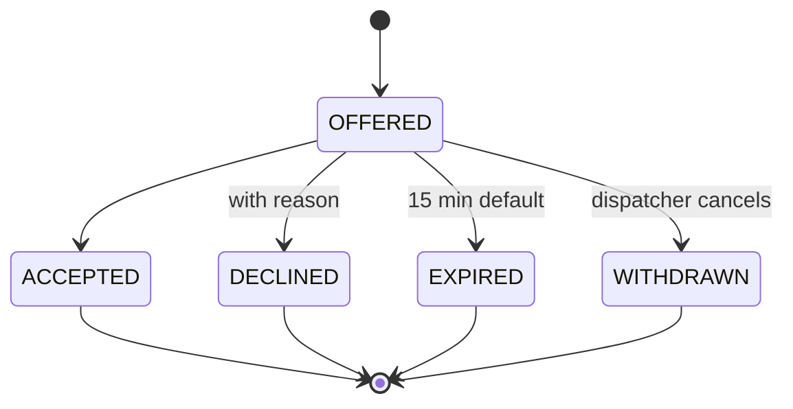
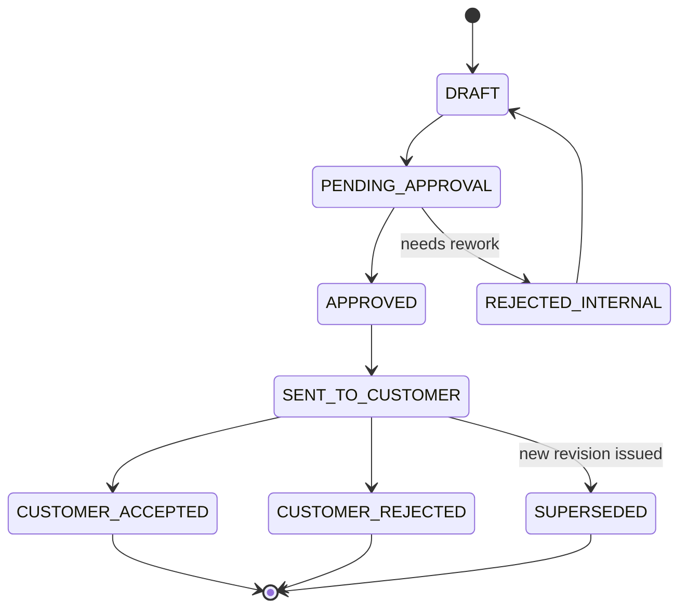
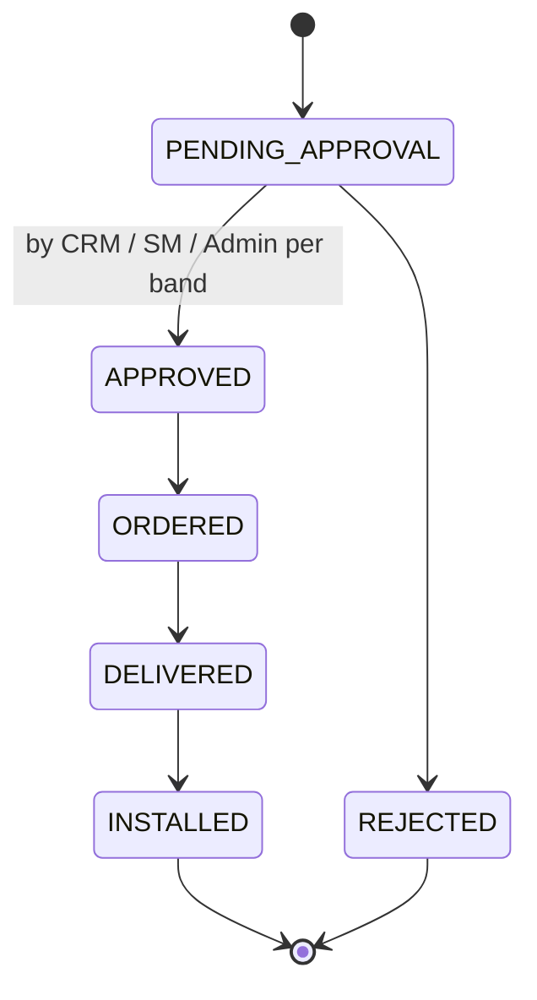

# AES Customer Portal — Workflow Re-Design Plan

> **Status:** Proposal for review. No code has been written.
> **Author goal:** Replace the current "random round-robin + SLA-only escalation" model with a realistic HVAC service-company workflow built around a human dispatcher, explicit accept/reject, a real site-engineer role, quote/budget approvals, and meaningful (not just timer-based) escalation.
>
> Read this end-to-end. After you sign off on Sections 4–8 (roles, scenarios, state machines, escalation rules), I will produce a phased implementation patch list and start coding.

---

## 0. TL;DR — What's broken and what we're changing

### What is broken today
1. **No human triage.** A ticket created at 02:14 AM is silently assigned to a sleeping CRM agent who may have 12 tickets already. Round-robin is blind to workload, locality, skill, or shift.
2. **No "site engineer" role.** `assign-engineer` accepts *any* user id. There is no field-technician pool, no skill, no calendar, no acceptance.
3. **No accept / reject.** A "newly assigned" ticket is silently your problem until the SLA breaches. There is no commitment moment.
4. **No quote workflow.** `InstallationStatus.QUOTE_SENT` / `QUOTE_ACCEPTED` exist in the enum but nothing in the backend produces, approves, or transitions a quote. The customer literally cannot accept or reject anything.
5. **No budget approval.** `part_requests` table exists, no service. Admin sign-off for high-cost work is fiction.
6. **Escalation is SLA-only.** Customers can't escalate. Engineers can't escalate. Managers can't grab a stuck ticket back for re-dispatch. The only trigger is "L1 didn't click Acknowledge in 30 minutes."
7. **Staff cannot drill into a ticket.** `/tickets/[ticketNumber]` redirects non-customers. Admin pipeline links are dead-ends.
8. **Customer cannot see who is handling them.** Only "CRM Acknowledged" / "Escalated to L2" — never a human name, ETA, or next step.
9. **`TicketActionController` has no role checks.** Anyone with a JWT can `escalate`, `resolve`, `assign-engineer`.
10. **Numbering / status drift.** Demo prefix is `AES-2026-…` but runtime sequence emits `TKT-…`. Demo install number is `INS-…` but runtime emits `REQ-…`. The "looks polished" demo is divergent from the actual system.

### What we are changing
- **Add 2 new roles**: `OPS_MANAGER` (the human dispatcher you described) and `SITE_ENGINEER` (the field technician who actually visits).
- **Insert a triage step** between *Customer Submits* and *CRM Owns It*. New tickets land in the **Ops Manager Inbox** first — never on a random CRM agent.
- **Add an Assignment Offer model** with a state machine (OFFERED → ACCEPTED / DECLINED / EXPIRED). Used for both CRM agents (overload case) and site engineers (every dispatch).
- **Model Quotes, Budget Approvals, and Part Requests** as first-class workflows with explicit states and approvers.
- **Re-define escalation** as a quality / supervision tool, not a stopwatch alarm: customer-initiated, engineer-initiated, supervisor-initiated, and SLA-breach (which now means "Ops Manager re-dispatches", not "auto-pole-vault to admin").
- **Give every role a real working dashboard** with the data it actually needs (workload, calendar, inbox, approvals queue).
- **Show the customer who is handling their request, their ETA, and what's about to happen.**

---

## 1. Business Context — Who is AES?

[Arial Engineering Services](https://www.arialengineering.com/) is a **19-year-old HVAC contractor** headquartered in Madhura Nagar, Hyderabad, with branches in Tirupati, Bangalore, and Goa. They install and service:

- **VRF/VRV systems**, **Chillers**, **DX systems**, **AHUs**, **Ventilation**, **Ductable / Cassette ACs**.

Their customer mix is **Residential, Commercial, Industrial, Hospitals, Offices, Retail, Hospitality** — projects like *DSR Classe*, *iSprout*, *Accenture*, *Adarsha Hospital*, *Cyber Gateway*, *Tabla Restaurant*.

Their internal departments (per their website): **Sales → Planning → Designing → Project Execution → Services → Customer Support**.

The portal we are building must model how **Services + Customer Support** actually operate for an HVAC contractor at this scale:

| Real-world AES function | Portal counterpart |
|---|---|
| Customer Support inbox / front-desk | `CRM_AGENT` (L1) |
| Service Coordinator who dispatches the day's work | `OPS_MANAGER` (**new**) |
| Field technician on a bike with a toolbox | `SITE_ENGINEER` (**new**) |
| Service Manager / branch service head | `SERVICE_MANAGER` (L2) |
| Management / Operations Director | `ADMIN` (L3) |

> This is exactly the structure you described: *"there should be a management guy after ticket comes, design a dashboard where he will see all tickets from customer … he will assign that ticket to CRM management team … CRM team can solve, then assigns site engineer."*

---

## 2. Current Architecture (what exists today)

### 2.1 Backend
- **Spring Boot 3 + PostgreSQL 16 + Flyway**.
- 13 entities, 14 enums, 16 services, 9 controllers, 6 migrations (V1–V6).
- **Auth**: phone+OTP (customers), phone+password (staff), JWT.
- **Tickets**: created → auto-assigned to a CRM via `AssignmentService.getNextAvailableCrmAgent()` (round-robin counter, no workload check).
- **Escalation**: `EscalationEngineService` runs every 30s. L1 unacked past `slaDeadlineL1` → auto L2. L2 past `slaDeadlineL2` → auto L3. L2 assignee = next service manager. L3 assignee = next admin.
- **Manual escalate**: `TicketActionService.escalateTicket(...)` — no role check, no assignee check, any user can call.
- **Installations**: create + list + detail only. No status-transition API.
- **Parts**: table + repository only. No service or controller.
- **AMC**: schedule visit endpoint exists; no engineer dispatch, no completion API.

### 2.2 Frontend
- **Next.js 14 App Router**, plain `.js`, no route groups.
- Customer routes: `/dashboard`, `/services/*`, `/tickets`, `/tickets/[n]`, `/notifications`, `/account`.
- Staff routes: `/crm` (CRM_AGENT), `/admin` (SERVICE_MANAGER + ADMIN), shared `/notifications`, `/account`.
- **Broken link**: `/crm/all` is in the header nav but the page doesn't exist.
- **Staff ticket detail = nothing.** Admin pipeline cards `Link href="/tickets/AES-2026-1102"` — staff get redirected to `/dashboard` because the page is customer-guarded.
- State: React Context wizard drafts (`installationStore`, `serviceStore`) — *not* Zustand. WebSocket via `useStompTopic` for live SLA + escalation pushes.

### 2.3 Demo seed (V4 + V5 + V6)
- 5 customers, 2 CRM agents, 2 service managers, 1 admin (all `password123`).
- 6 service tickets (`AES-2026-1100..1106`) and 4 installation requests (`INS-2026-2101..2104`) curated for the demo script.

---

## 3. Flaws — Comprehensive List

| # | Flaw | Severity | Where |
|---|---|---|---|
| F1 | New tickets auto-assigned with **no human triage** | Critical | `ServiceTicketService.createTicket` |
| F2 | No `SITE_ENGINEER` role; `assign-engineer` accepts any user id | Critical | `UserRole`, `TicketActionService.assignEngineer` |
| F3 | No accept/reject on assignment — silent ownership | Critical | None — concept missing |
| F4 | Round-robin is blind to workload, locality, skill, shift | Critical | `AssignmentService` |
| F5 | Customer cannot escalate ("call my manager") | High | `TicketActionController.escalate` (no customer route) |
| F6 | Engineer cannot escalate ("I need parts / I'm stuck") | High | No engineer role at all |
| F7 | Escalation only triggers on SLA stopwatch — no quality lever | High | `EscalationEngineService` |
| F8 | `InstallationStatus` enum has 8 states; **0 transition APIs** | Critical | `InstallationRequestService` |
| F9 | No quote model, no quote document, no customer accept/reject of quote | Critical | None — missing entity |
| F10 | No budget approval workflow for high-cost work | High | None — missing entity |
| F11 | `part_requests` table exists but has zero service code | High | Dead table |
| F12 | `TicketActionController` has **no role guards** — security hole | Critical | `TicketActionController` |
| F13 | Staff have no ticket-detail page (`/tickets/[n]` redirects staff away) | High | `app/tickets/[ticketNumber]/page.js` |
| F14 | Admin `/admin` page can only Escalate + Resolve — cannot Assign, Reassign, Approve | High | `app/admin/page.js` |
| F15 | `/crm/all` linked from nav, route does not exist (404) | Medium | `BottomNav.js` / `Header.js` |
| F16 | `AmcVisit.status` is `String`, all other status fields are enums | Low | `AmcVisit.java` |
| F17 | No `WorkloadService` — assignment can't see "Ravi has 8 open tickets" | High | None |
| F18 | No staff calendar / shift / availability concept | High | None |
| F19 | No engineer mobile workflow (accept dispatch, mark en-route, complete with photos) | High | None |
| F20 | Customer never sees the human name, ETA, or current step | High | `EscalationLadder` + ticket detail |
| F21 | Numbering drift: `TKT-…` vs `AES-…`, `REQ-…` vs `INS-…` | Low | `ServiceTicketService`, `InstallationRequestService` |
| F22 | Manual `escalate` skips Ops Manager and jumps straight to L2 | Medium | `TicketActionService.escalateTicket` |
| F23 | Auto-escalation hits L3 (admin) very quickly on SLA breach — admins drown in noise | Medium | `EscalationEngineService` |
| F24 | No reopen / re-investigate flow if customer rates 1-2 stars | Medium | `TicketActionService.rateTicket` |
| F25 | No way for Ops Manager to ask a busy CRM "can you take one more?" with their consent | High | None |

---

## 4. Revised Role Hierarchy

We add **two roles** and re-scope the existing four. Backwards-compatible: old roles keep working, new ones are additive.

| Tier | Role | Internal title (AES-style) | Primary responsibility |
|---|---|---|---|
| L0 | `CUSTOMER` | — | Raises installation / service requests, accepts quotes, rates closures |
| **L1d** | **`OPS_MANAGER`** *(new)* | Service Coordinator / Dispatcher | **Triages every new ticket / install** before it touches the team. Assigns to CRM (direct or by invitation). Reassigns when CRM goes offline. Owns the daily dispatch board. |
| L1 | `CRM_AGENT` | Customer Support Executive | Owns the customer relationship for the case. Confirms problem, schedules visit, **dispatches Site Engineer**, follows up till closure. |
| **L1e** | **`SITE_ENGINEER`** *(new)* | Field Service Engineer / Technician | Accepts dispatch, travels to site, diagnoses, fixes, raises part requests, marks RESOLVED with photos & notes. |
| L2 | `SERVICE_MANAGER` | Service Manager (branch) | Handles escalations, approves Part Requests up to ₹X, approves Quotes up to ₹Y, intervenes on complex cases. |
| L3 | `ADMIN` | Operations Head / Director | Final escalation. Approves Part Requests and Quotes above L2 threshold. Reviews KPIs, branch performance, complaint trends. |

### Authorization matrix (who can do what)

Legend: ✓ = allowed, ✓ⓐ = allowed only on tickets assigned to them, — = denied.

| Action | CUSTOMER | OPS_MANAGER | CRM_AGENT | SITE_ENGINEER | SERVICE_MANAGER | ADMIN |
|---|---|---|---|---|---|---|
| Create service ticket | ✓ⓐ (own AC) | ✓ (on behalf) | ✓ (on behalf) | — | ✓ (on behalf) | ✓ |
| Create installation request | ✓ | ✓ | ✓ | — | ✓ | ✓ |
| **Triage / offer ticket to CRM** | — | ✓ | — | — | ✓ (override) | ✓ (override) |
| Accept assignment offer (CRM) | — | — | ✓ⓐ | — | — | — |
| Decline assignment offer (CRM) | — | — | ✓ⓐ | — | — | — |
| **Dispatch site engineer** | — | ✓ (override) | ✓ⓐ | — | ✓ | ✓ |
| Accept dispatch offer (engineer) | — | — | — | ✓ⓐ | — | — |
| Mark en-route / on-site | — | — | — | ✓ⓐ | — | — |
| Raise Part Request | — | — | — | ✓ⓐ | ✓ⓐ | ✓ |
| Approve Part Request ≤ ₹5k | — | ✓ | ✓ⓐ | — | ✓ | ✓ |
| Approve Part Request ₹5k–₹50k | — | — | — | — | ✓ | ✓ |
| Approve Part Request > ₹50k | — | — | — | — | — | ✓ |
| Prepare installation Quote | — | ✓ | ✓ⓐ | — | ✓ | ✓ |
| Approve Quote ≤ ₹2L | — | — | — | — | ✓ | ✓ |
| Approve Quote > ₹2L | — | — | — | — | — | ✓ |
| Mark RESOLVED | — | — | ✓ⓐ | ✓ⓐ | ✓ⓐ | ✓ |
| **Escalate (customer)** | ✓ⓐ | — | — | — | — | — |
| **Escalate (engineer "need help")** | — | — | — | ✓ⓐ | — | — |
| **Escalate (supervisor "I'll take over")** | — | ✓ | ✓ⓐ | — | ✓ | ✓ |
| Re-open closed ticket within 7 days | ✓ⓐ | ✓ | ✓ⓐ | — | ✓ | ✓ |
| Read all tickets | — | ✓ (branch) | ✓ⓐ | ✓ⓐ | ✓ | ✓ |
| Read all installs | — | ✓ | ✓ⓐ | — | ✓ | ✓ |

> **Implementation note:** This becomes a Spring Security `@PreAuthorize` matrix in `TicketActionController`, `InstallationController`, and new `AssignmentController`, `QuoteController`, `PartRequestController`. Replaces the current "any authenticated user can do anything" hole.

---

## 5. The Two Master Flows (start here)

> These two diagrams are the **single source of truth**. Every other flow is a variation.

### 5.1 Flow A — Service Ticket (existing customer)



### 5.2 Flow B — Installation Request (new or existing customer)



---

## 6. Scenario Catalogue — every situation you described, and a few more

Each scenario maps to one or both of the master flows above.

### S1 — New Customer, First Installation
- Customer signs up (OTP), no existing properties.
- Wizard creates the **Property + first AC needs** during the install request.
- Goes through **Flow B** end-to-end.
- After `COMPLETED`, the system auto-creates the AC unit records, links them, and shows an **AMC sign-up offer** card on the dashboard.

### S2 — Existing Customer, Additional Installation
- Same as S1 but property pre-selected.
- If the customer is `AMC active`, the wizard offers a **5% loyalty discount** (visible on the quote).

### S3 — Existing Customer, Service Ticket (P1 AMC / P2 Warranty)
- **Flow A**. No estimate required (covered). Site engineer fixes; if part needed → **internal** budget approval. Customer pays nothing.

### S4 — Existing Customer, Service Ticket (P3 Paid)
- **Flow A** with extra step: after CRM confirms the problem, CRM (or engineer post-diagnosis) raises an **Estimate** which the **customer must accept** before work proceeds.
- If diagnosis estimate < ₹500: auto-approve (visit charge only).
- If estimate ₹500–₹5k: CRM approves and shows to customer.
- If estimate > ₹5k: Service Manager approves internally first, then customer.

### S5 — Scheduled AMC Visit (no ticket)
- AMC contract has 4 visits/yr. Ops Manager sees upcoming visits on a calendar.
- Ops Mgr **dispatches site engineer** for each (Flow A from step H onwards — no triage needed because there's no ticket).
- Engineer marks `COMPLETED` and `visits_completed` increments. AC service status may reset.

### S6 — Customer-Initiated Escalation
- Customer taps **"Escalate"** on a stale or unsatisfactory ticket.
- Reason picker: *Slow response*, *Wrong diagnosis*, *Engineer rude*, *Other*.
- Ticket flips to `ESCALATED_BY_CUSTOMER`, **goes back to Ops Manager Inbox** with a red flag, and Ops Mgr can re-assign / push to L2.
- **L1→L2 jump only happens if Ops Mgr chooses to push it there.** No silent jumps.

### S7 — Engineer-Initiated Escalation ("I'm stuck")
- Engineer in the field opens the ticket and taps **"Need Help"** with a reason: *Needs senior tech*, *Customer dispute*, *Equipment beyond scope*, *Safety*.
- Pings the assigned CRM agent **and** the Service Manager. Customer is informed *"A senior technician is being arranged"*.
- Service Manager can accept the case or send another engineer.

### S8 — Supervisor-Initiated Escalation / Reassignment
- Ops Mgr or Service Manager pulls a ticket back from a CRM/engineer who is unresponsive or unavailable, and reassigns. Activity timeline records: *"Reassigned by [name] — reason: [text]"*.

### S9 — SLA Breach (the one we already half-have)
- L1 hasn't accepted in 15 min → offer **expires**, ticket goes back to Ops Mgr with red flag. Ops Mgr re-offers to next agent.
- If Ops Mgr also doesn't move it in 30 min from creation → ticket auto-escalates to **L2 Service Manager inbox**.
- If L2 SLA breaches → notify L3 Admin (but do **not** auto-transfer ownership; instead show a "Needs Attention" card on Admin dashboard).
- Final resolution SLA breach (P1: 4h, P2: 8h, P3: 24h) → email/SMS Admin + customer apology with new ETA.

### S10 — "Both my CRMs are busy, please take one more" (your scenario)
- Ops Mgr opens triage inbox at 11 AM. New P1 ticket arrives. Both CRMs have 6 open tickets each (workload board shows red).
- Ops Mgr picks Lakshmi, clicks **"Invite to take extra"** with a free-text note: *"Aarav is a VIP, can you squeeze this in?"*.
- Lakshmi gets a **toast + notification + dashboard card**: *"Ops Mgr Anand is asking you to take AES-2026-1107"*. Two buttons: **Accept** / **Decline (with reason)**.
- Accept → ticket becomes hers, normal Flow A. Decline → Ops Mgr re-decides (try Ravi, push to L2, defer).

### S11 — CRM Going Off-Shift
- CRM agent toggles **"End Shift"** in their account. Their open tickets become **"Pending Re-Assignment"** in Ops Mgr inbox. Ops Mgr re-offers each. (No customer-facing change; assignee just flips.)

### S12 — Repeat Visit / Re-Opening a Ticket
- Customer rates a ticket 1-2 stars within 7 days → ticket reopens with a new sub-activity `REOPENED`, status `IN_PROGRESS`, original assignee. Ops Mgr sees a red flag.
- After 7 days, customer can still raise a **linked** ticket ("AES-2026-2001 - related to closed 1102"), which gets P-priority bumped up automatically.

### S13 — Customer Requests Reschedule
- Customer taps **"Reschedule"** on a ticket. Picks new slot. If engineer is already EN_ROUTE → blocked, prompted to call. Otherwise → request goes to assigned CRM, who accepts/declines (because engineer's calendar moves too).

### S14 — Engineer Goes Sick / Vehicle Breakdown
- Engineer opens their ticket and taps **"Cannot Attend"** with reason. Triggers same Reassign flow as S8 but auto-pinged.

---

## 7. State Machines

### 7.1 ServiceTicket



**Status enum migration (additive, no breakage):**

| Existing | New | Notes |
|---|---|---|
| `OPEN` | `NEW` (treat as alias) | Backward-compatible read |
| `ACKNOWLEDGED` | `ACKNOWLEDGED` | unchanged |
| `ASSIGNED` | `ASSIGNED` | now strictly means "engineer accepted dispatch" |
| (new) | `OFFERED_CRM`, `OFFERED_L2` | assignment pending CRM accept |
| (new) | `ENGINEER_OFFERED` | dispatch pending engineer accept |
| (new) | `EN_ROUTE`, `ON_SITE` | engineer-driven status |
| `IN_PROGRESS` | `IN_PROGRESS` | unchanged |
| (new) | `WAITING_PART`, `WAITING_CUSTOMER_APPROVAL` | block on dependency |
| (new) | `ESCALATED_BY_CUSTOMER` | distinct from supervisor-driven |
| `RESOLVED`, `CLOSED`, `CANCELLED` | unchanged | |
| (new) | `REOPENED` | sub-status after CLOSED |

### 7.2 InstallationRequest



### 7.3 AssignmentOffer (new entity)



### 7.4 Quote (new entity)



### 7.5 PartRequest (existing table, new lifecycle)



---

## 8. Re-defined Escalation Rules

We replace "two timers" with a **4-trigger model**.

### 8.1 The 4 triggers

| Trigger | Who fires it | What happens |
|---|---|---|
| **T1 — Customer-initiated** | CUSTOMER taps "Escalate" | Status → `ESCALATED_BY_CUSTOMER`. Ticket re-appears in **Ops Mgr inbox** with red flag. Ops Mgr decides: re-route to different CRM, push to L2, or call customer. |
| **T2 — Engineer-initiated** | SITE_ENGINEER taps "Need Help" | CRM + Service Mgr notified. No automatic owner change. Service Mgr can claim or delegate. |
| **T3 — Supervisor-initiated** | OPS_MGR / SM / ADMIN clicks "Take over" | Direct reassignment with reason. Activity logged. |
| **T4 — SLA-breach** | EscalationEngineService scheduled job | See ladder below. **No silent jumps to L3.** |

### 8.2 The new SLA ladder (replaces current auto L1→L2→L3)

| When | Action | Customer message |
|---|---|---|
| Ticket created | OFFERED to CRM with **15 min accept window** | "We've received your request. Assigning the right person." |
| CRM doesn't accept in 15 min | Offer **EXPIRED**. Ticket bounced back to Ops Mgr inbox **once**. Notify Ops Mgr. | (silent) |
| 30 min after creation, still no human owner | Auto-escalate to **L2 Service Mgr inbox**. Notify Ops Mgr + on-shift SM. | "Connecting you to a senior team member for faster help." |
| Final SLA breach (P1: 4h, P2: 8h, P3: 24h) | **Notify L3 Admin** + customer. **Do not transfer ownership** — the people working on it stay. | "We're sorry for the delay. Our management is now monitoring." |
| L2 hasn't resolved within 2× final SLA | Admin gets a critical alert + dashboard banner. | (no extra customer message) |

**Why this is better than today's behaviour:**

| Today | Tomorrow |
|---|---|
| Customer can't escalate | Customer can escalate any time |
| Engineer can't escalate | Engineer can flag "need help" |
| SLA breach → silent auto-jump to L2/L3 | SLA breach → ops mgr re-dispatch → only then L2; L3 is **monitor only** |
| Admin gets every overdue ticket dumped on them | Admin only sees the **truly stuck** ones |
| "Escalation" is a confusing, mechanical thing | "Escalation" has 4 clear, human reasons |

---

## 9. Dashboards — what each role sees

### 9.1 `OPS_MANAGER` dashboard (NEW — `/ops`)
**The dashboard you asked for.** Single screen, branch-scoped, refresh every 30 s + WebSocket.

- **Top KPIs:** New (untriaged), Pending CRM accept, Pending engineer accept, Escalated by customer, SLA red zone, AMC visits due today, Quotes pending approval.
- **Triage Inbox** (3-column kanban):
  - **NEW** (untriaged tickets + new install requests, sorted P1 → P3 then oldest first)
  - **OFFERED_CRM** (waiting for accept, with 15-min countdown chip)
  - **OFFERED_ENGINEER** (waiting for engineer to accept dispatch)
- **CRM Workload board** (table or card grid):
  - Each CRM row: name + photo + on-shift toggle + counts (Active, Accepted today, Avg ack time, % SLA met).
  - Action buttons per row: **Assign**, **Invite (request to accept)**, **View tickets**.
- **Engineer Availability board:**
  - Each engineer: name + locality chip + skill chips (`Split`, `VRF`, `Chiller`…) + today's calendar strip (booked slots) + **Dispatch** button.
- **Live Map (Phase 2):** engineers' last-known location colour-coded by status (`AVAILABLE`, `EN_ROUTE`, `ON_SITE`, `OFF_SHIFT`).
- **Quotes & Approvals queue** (small panel): items waiting for SM/Admin sign-off (Ops Mgr is observer; he routes if blocked).

### 9.2 `CRM_AGENT` dashboard (`/crm`, redesigned)
- **My Inbox tabs:** Accept Required (offers I haven't responded to), Active (acknowledged + assigned), Waiting (waiting on customer / part / engineer), Resolved Today.
- **Per-ticket card:** customer name + priority + SLA chip + **next-action** button (Acknowledge, Dispatch Engineer, Update Customer, Resolve).
- **Engineer picker (modal):** filtered by locality, skill, current load; shows "this engineer's next free slot is 3:30 PM".
- **Invitation toast:** when Ops Mgr requests me to take extra — full-width card with Accept / Decline (with reason).
- **Notes & call-log** per ticket (we'll add a simple text + timestamp model so CRM has somewhere to capture "called customer at 11:14, will call back after lunch").

### 9.3 `SITE_ENGINEER` mobile-first dashboard (NEW — `/engineer`)
- **Today's Jobs** list, time-ordered, with map + customer phone + AC details.
- **Pending Dispatch Offers** (sticky banner with Accept / Decline + reason).
- **Active Job** with status pills the engineer taps in order: `EN_ROUTE` → `ON_SITE` → `DIAGNOSING` → `FIXING` → `WAITING_PART` (opens part-request form) → `RESOLVED` (opens photo + notes form).
- **My Calendar** (week view).
- **Need Help** button anywhere → opens reason + free text → fires T2 escalation.

### 9.4 `SERVICE_MANAGER` dashboard (`/admin/escalation`, refocused)
- **Escalation Queue:** ESCALATED_BY_CUSTOMER + L2 inbox + engineer "Need Help" pings.
- **Approvals Queue:** Quotes ≤ ₹2L + Part Requests ₹5k–₹50k.
- **Branch KPIs:** CSAT, FCR (First-Call-Resolution), SLA compliance.
- **All tickets** searchable table.
- Can use the **same CRM screen** + **engineer picker** when stepping in.

### 9.5 `ADMIN` dashboard (`/admin`, refocused)
- All of SM dashboard +
- **Approvals Queue (high band):** Quotes > ₹2L + Part Requests > ₹50k.
- **Critical Alerts:** SLA-double-breached tickets, complaint trends, low-CSAT engineers.
- **People Management:** add/disable users, toggle on-shift, view utilisation.
- **Branch comparison** (Hyderabad vs Tirupati vs Bangalore vs Goa — multi-branch is Phase 2 but the model supports it).

### 9.6 `CUSTOMER` dashboard / ticket detail (refresh)
- Show **the human handling your case** (name + role chip) when assigned, with a phone-call CTA for paid plans / VIP.
- Show **next step + ETA**: *"Ravi will call you by 11:30 AM"*, *"Engineer Suresh is on the way — ETA 2:15 PM"*.
- **Escalate** button (T1) with reason picker on every active ticket.
- **Quote viewer** for installation requests (line items + Accept / Reject / Negotiate buttons).
- **Live status tracker** (replaces the SLA-timer-as-only-feedback).

---

## 10. Backend — concrete changes required

### 10.1 Schema (Flyway `V7__workflow_redesign.sql`)

```sql
-- 1. New roles
ALTER TYPE user_role ADD VALUE IF NOT EXISTS 'OPS_MANAGER';
ALTER TYPE user_role ADD VALUE IF NOT EXISTS 'SITE_ENGINEER';
-- (or VARCHAR column — keep current approach, just allow new strings)

-- 2. Staff metadata
CREATE TABLE staff_profiles (
    user_id UUID PRIMARY KEY REFERENCES users(id),
    branch VARCHAR(50) DEFAULT 'HYDERABAD',
    on_shift BOOLEAN NOT NULL DEFAULT FALSE,
    shift_start TIME, shift_end TIME,
    skills TEXT[],                    -- e.g. {'SPLIT','VRF','CHILLER'}
    localities TEXT[],                -- e.g. {'JUBILEE_HILLS','GACHIBOWLI'}
    max_concurrent_load INT DEFAULT 8,
    avg_resolution_minutes INT,
    csat_score NUMERIC(3,2),
    last_seen_at TIMESTAMPTZ
);

-- 3. Assignment offers (covers BOTH CRM-accept and engineer-dispatch flows)
CREATE TABLE assignment_offers (
    id UUID PRIMARY KEY DEFAULT uuid_generate_v4(),
    ticket_id UUID REFERENCES service_tickets(id),
    install_id UUID REFERENCES installation_requests(id),
    offered_to UUID NOT NULL REFERENCES users(id),
    offered_by UUID NOT NULL REFERENCES users(id),
    offer_type VARCHAR(20) NOT NULL,  -- 'CRM_OWNER','ENGINEER_DISPATCH'
    note TEXT,                        -- "Aarav is a VIP, please squeeze in"
    status VARCHAR(20) NOT NULL DEFAULT 'OFFERED',
    decline_reason TEXT,
    expires_at TIMESTAMPTZ NOT NULL,
    responded_at TIMESTAMPTZ,
    created_at TIMESTAMPTZ NOT NULL DEFAULT NOW(),
    CHECK ((ticket_id IS NOT NULL) <> (install_id IS NOT NULL))
);
CREATE INDEX idx_offers_offered_to_status ON assignment_offers(offered_to, status);

-- 4. Quotes (for installations and P3 estimates)
CREATE TABLE quotes (
    id UUID PRIMARY KEY DEFAULT uuid_generate_v4(),
    install_id UUID REFERENCES installation_requests(id),
    ticket_id UUID REFERENCES service_tickets(id),
    quote_number VARCHAR(30) UNIQUE NOT NULL, -- QUO-2026-0001
    version INT NOT NULL DEFAULT 1,
    line_items_json JSONB NOT NULL,           -- [{desc, qty, unit_price, gst}]
    subtotal NUMERIC(12,2) NOT NULL,
    tax NUMERIC(12,2) NOT NULL,
    discount NUMERIC(12,2) DEFAULT 0,
    total NUMERIC(12,2) NOT NULL,
    valid_until DATE,
    status VARCHAR(30) NOT NULL DEFAULT 'DRAFT',
    prepared_by UUID REFERENCES users(id),
    approved_by UUID REFERENCES users(id),
    sent_at TIMESTAMPTZ,
    customer_decision VARCHAR(20),            -- ACCEPTED/REJECTED/NEGOTIATE
    customer_decided_at TIMESTAMPTZ,
    notes TEXT,
    created_at TIMESTAMPTZ NOT NULL DEFAULT NOW(),
    updated_at TIMESTAMPTZ NOT NULL DEFAULT NOW(),
    CHECK ((install_id IS NOT NULL) <> (ticket_id IS NOT NULL))
);

-- 5. Extend service_tickets
ALTER TABLE service_tickets
  ADD COLUMN IF NOT EXISTS triage_at TIMESTAMPTZ,
  ADD COLUMN IF NOT EXISTS triaged_by UUID REFERENCES users(id),
  ADD COLUMN IF NOT EXISTS engineer_id UUID REFERENCES users(id),
  ADD COLUMN IF NOT EXISTS engineer_accepted_at TIMESTAMPTZ,
  ADD COLUMN IF NOT EXISTS en_route_at TIMESTAMPTZ,
  ADD COLUMN IF NOT EXISTS on_site_at TIMESTAMPTZ,
  ADD COLUMN IF NOT EXISTS branch VARCHAR(50) DEFAULT 'HYDERABAD',
  ADD COLUMN IF NOT EXISTS locality VARCHAR(100),
  ADD COLUMN IF NOT EXISTS estimated_cost NUMERIC(10,2),
  ADD COLUMN IF NOT EXISTS estimate_status VARCHAR(20),  -- DRAFT/SENT/ACCEPTED/REJECTED
  ADD COLUMN IF NOT EXISTS escalation_reason VARCHAR(40); -- for ESCALATED_BY_CUSTOMER

-- 6. Extend installation_requests
ALTER TABLE installation_requests
  ADD COLUMN IF NOT EXISTS triage_at TIMESTAMPTZ,
  ADD COLUMN IF NOT EXISTS triaged_by UUID REFERENCES users(id),
  ADD COLUMN IF NOT EXISTS site_visit_at TIMESTAMPTZ,
  ADD COLUMN IF NOT EXISTS site_visit_engineer_id UUID REFERENCES users(id),
  ADD COLUMN IF NOT EXISTS lead_engineer_id UUID REFERENCES users(id);

-- 7. Part requests (already exists, just needs to be wired)
-- no DDL change required.

-- 8. Notes / call log (so CRM can write "called customer 11:14")
CREATE TABLE ticket_notes (
    id UUID PRIMARY KEY DEFAULT uuid_generate_v4(),
    ticket_id UUID NOT NULL REFERENCES service_tickets(id),
    author_id UUID NOT NULL REFERENCES users(id),
    note_type VARCHAR(20) NOT NULL DEFAULT 'INTERNAL', -- INTERNAL/CUSTOMER_CALL/SMS/WHATSAPP
    body TEXT NOT NULL,
    created_at TIMESTAMPTZ NOT NULL DEFAULT NOW()
);
```

### 10.2 New services

| Service | Purpose |
|---|---|
| `TriageService` | List untriaged tickets/installs, `triageToCrm(ticketId, crmId, asInvitation)`, `bypassToL2(...)`. |
| `AssignmentOfferService` | `offer(...)`, `accept(offerId)`, `decline(offerId, reason)`, `expireOverdueOffers()` scheduled, `withdraw(offerId)`. |
| `WorkloadService` | `getCrmWorkload(branch?)`, `getEngineerAvailability(locality?, skill?)`, `recommendCrm(...)`, `recommendEngineer(...)`. |
| `EngineerDispatchService` | `dispatch(ticketId, engineerId)`, `markEnRoute(ticketId)`, `markOnSite(ticketId)`, `markResolved(ticketId, body)`. |
| `QuoteService` | `draftFromInstall(...)`, `addLineItem(...)`, `submitForApproval(...)`, `approve(...)`, `sendToCustomer(...)`, `customerAccept(...)`, `customerReject(...)`, `revise(...)`. |
| `PartRequestService` | `raise(...)`, `approve(...)`, `markOrdered/Delivered/Installed(...)`. Wires the existing dead table. |
| `EscalationService` (replaces current `EscalationEngineService`) | The 4-trigger model. Scheduled job only does T4 (and only the new ladder rules). |
| `StaffProfileService` | shift toggle, skill/locality CRUD, branch assignment. |
| `NotesService` | Add/list ticket notes. |

### 10.3 Service changes

- **`ServiceTicketService.createTicket`** stops calling `assignmentService.getNextAvailableCrmAgent()`. New tickets are saved with `status=NEW`, `currentAssignee=NULL`, `triageAt=NULL`. A notification is fired to **all on-shift Ops Managers** (or fallback to admins if none).
- **`InstallationRequestService.create`** same change — no auto-broadcast to all CRMs; goes to Ops Mgr inbox.
- **`EscalationEngineService`** scheduled job — replace logic with **new SLA ladder** (sections 8.2). Add second scheduled job for `expireOverdueOffers` (every 60 s).
- **`TicketActionService.acknowledgeTicket`** is removed from the customer-creation path; acknowledge now only happens via `AssignmentOfferService.accept(...)`.
- **`TicketActionService.assignEngineer`** routes through `EngineerDispatchService.dispatch(...)` which **creates an AssignmentOffer** instead of forcing ownership.

### 10.4 Controllers

| New / changed | Endpoints |
|---|---|
| `TriageController` (new) | `GET /api/v1/triage/inbox`, `POST /api/v1/triage/tickets/{n}/offer`, `POST /api/v1/triage/tickets/{n}/bypass-l2` |
| `OffersController` (new) | `GET /api/v1/offers/mine`, `POST /api/v1/offers/{id}/accept`, `POST /api/v1/offers/{id}/decline`, `POST /api/v1/offers/{id}/withdraw` |
| `EngineerController` (new) | `GET /api/v1/engineer/my-jobs`, `POST /api/v1/tickets/{n}/en-route`, `POST /api/v1/tickets/{n}/on-site`, `POST /api/v1/tickets/{n}/need-help` |
| `QuoteController` (new) | `POST /api/v1/quotes` (draft), `POST /api/v1/quotes/{id}/submit`, `POST /api/v1/quotes/{id}/approve`, `POST /api/v1/quotes/{id}/send`, `POST /api/v1/quotes/{id}/customer-decision` |
| `PartRequestController` (new) | `POST /api/v1/tickets/{n}/parts`, `POST /api/v1/parts/{id}/approve`, `POST /api/v1/parts/{id}/ordered`, `POST /api/v1/parts/{id}/delivered` |
| `WorkloadController` (new) | `GET /api/v1/workload/crm`, `GET /api/v1/workload/engineers` |
| `StaffController` (new) | `PUT /api/v1/staff/me/shift`, `GET /api/v1/staff` (admin) |
| `TicketActionController` (changed) | Add `@PreAuthorize` everywhere; `escalate` becomes role-aware (T1/T2/T3 branches) |
| `InstallationController` (extended) | Add status-transition endpoints: `survey-scheduled`, `survey-done`, `schedule-install`, `start-install`, `complete-install` |

### 10.5 Authorization

Every new and existing controller gets explicit `@PreAuthorize` annotations matching Section 4's matrix. Closes **F12** completely.

### 10.6 Numbering & demo data

- Fix runtime sequences to emit `AES-{YYYY}-{seq}` and `INS-{YYYY}-{seq}` so demo and production are consistent (closes **F21**).
- New migration `V7__seed_workflow_demo.sql`:
  - Add `OPS_MANAGER` user **Meera Nair** (+91 9000066666 / `password123`).
  - Add `SITE_ENGINEER` users: **Rajesh Verma** (+91 9000077777, Split/VRF, Jubilee Hills/Gachibowli), **Imran Khan** (+91 9000088888, Cassette/Chiller, Madhapur/Hitech), **Sandeep Rao** (+91 9000099999, all-rounder, Banjara/Begumpet).
  - Pre-create staff profiles with `on_shift=true`.
  - For each existing demo ticket, set `branch`, `locality`, `triage_at`, `triaged_by=Meera`, `engineer_id` where appropriate.
  - Pre-create one **AssignmentOffer** in `OFFERED` state on a fresh demo ticket so the "accept/decline" demo button works on first start.
  - Pre-create one **Quote** in `SENT_TO_CUSTOMER` on Aarav's `INS-2026-2104` so the customer-accept demo works on first start.

---

## 11. Frontend — concrete changes required

> No new framework. Stick with Next.js + plain JS + React Context (which is what already exists). Add new routes; keep the design system.

### 11.1 New routes

| Route | Role | Notes |
|---|---|---|
| `/ops` | OPS_MANAGER (and ADMIN) | The dispatcher dashboard (Section 9.1). Default route for OPS_MANAGER. |
| `/ops/workload` | OPS_MANAGER | Workload board only (deep-link). |
| `/ops/calendar` | OPS_MANAGER | Engineer calendar week view. |
| `/engineer` | SITE_ENGINEER | Mobile-first daily job list. Default route. |
| `/engineer/jobs/[n]` | SITE_ENGINEER | Job detail with status pills. |
| `/staff/tickets/[ticketNumber]` | any staff | The **staff ticket detail** page that today is missing (replaces dead admin links). Closes **F13** + **F14**. |
| `/quotes/[quoteNumber]` | CUSTOMER (own) / staff | Quote viewer + accept/reject for customers; editor for staff. |
| `/crm/all` | CRM_AGENT + above | Implement the page that's already linked (closes **F15**). |

### 11.2 Changed routes

- `/crm` — redesign per Section 9.2 (Inbox tabs, Engineer picker modal, Invitation toast).
- `/admin` — refocus per Section 9.4 (escalation queue + approvals).
- `/tickets/[n]` (customer) — show assignee name, ETA, **Escalate** button, **Quote viewer** for P3 estimates, live tracker.
- `/services/installation/success` — show quote-coming-soon message + WS subscription so the quote viewer auto-opens when ready.

### 11.3 New components

- `TriageKanban`, `WorkloadBoard`, `EngineerAvailabilityGrid`, `OfferBanner` (accept/decline), `EngineerPickerModal`, `QuoteBuilder` (line items), `QuoteViewerCustomer`, `PartRequestForm`, `ShiftToggle`, `StatusPills` (en-route/on-site for engineer).
- `RoleGuard` (drop-in replacement for the inline `if (role !== ...)` checks scattered today).

### 11.4 Auth context update

`defaultRouteForRole` returns:
- `OPS_MANAGER` → `/ops`
- `SITE_ENGINEER` → `/engineer`
- existing returns unchanged.

### 11.5 WebSocket topics (additions)

- `/topic/ops/inbox` — new triage items
- `/topic/users/{userId}/offers` — assignment offers (CRM + engineer share this)
- `/topic/engineer/{userId}/jobs` — today's job changes
- `/topic/quotes/{quoteNumber}` — approval / customer decision

---

## 12. Phased Implementation Plan (so we ship in increments, not Big-Bang)

> Each phase ends with a working build the client can poke at. We do **not** go phase N+1 until you've validated phase N visually.

### Phase 1 — Backend foundation (no UI change)
1. Add `OPS_MANAGER` + `SITE_ENGINEER` roles. Seed demo users.
2. `staff_profiles`, `assignment_offers`, `quotes`, `ticket_notes` tables (V7).
3. Stop auto-assigning new tickets/installs to CRMs (status = `NEW`, owner = null). Notify Ops Mgr.
4. Replace `EscalationEngineService` logic with new SLA ladder (T4 only).
5. Add `@PreAuthorize` to `TicketActionController`.
6. Verify nothing customer-facing breaks (existing tickets still show, dashboards still load).

### Phase 2 — Triage + Accept/Reject (Ops Mgr + CRM)
1. `TriageService` + `TriageController`.
2. `AssignmentOfferService` + `OffersController`.
3. `/ops` dashboard MVP (inbox + CRM workload table + Assign / Invite buttons).
4. CRM `/crm` shows pending offers card with Accept / Decline.
5. Demo: Meera triages → invites Lakshmi → Lakshmi accepts → ticket moves into her active list.

### Phase 3 — Site Engineer dispatch
1. `EngineerDispatchService`, engineer status endpoints, `EngineerController`.
2. `/engineer` mobile dashboard.
3. CRM `/crm` gets **Engineer Picker** modal with availability/skill filter.
4. Customer ticket detail shows engineer name + status pills.
5. Demo: Lakshmi picks Rajesh → Rajesh accepts → Rajesh marks en-route → on-site → resolved → customer rates.

### Phase 4 — Quote workflow
1. `QuoteService`, `QuoteController`.
2. Staff `QuoteBuilder` UI inside install detail.
3. Customer `QuoteViewerCustomer` with Accept / Reject / Negotiate.
4. SM/Admin approval queue in `/admin`.
5. Demo: Meera triages Priya's install → assigns CRM → CRM books survey → engineer surveys → CRM drafts quote → SM approves → Priya accepts → install gets scheduled.

### Phase 5 — Part requests + Budget approvals
1. Wire `part_requests` table to `PartRequestService` + controller.
2. Engineer raises part request from `/engineer/jobs/[n]`.
3. Approval bands routed to CRM / SM / Admin.
4. Customer sees "Waiting for spare part" status + ETA.

### Phase 6 — Customer & Engineer escalation triggers (T1, T2)
1. Customer "Escalate" button + reason picker.
2. Engineer "Need Help" button + reason picker.
3. Both feed back into Ops Mgr inbox (T1) or SM inbox (T2).

### Phase 7 — Polish, calendar, locality, KPIs
1. Engineer week calendar.
2. Locality-based assignment recommendations.
3. Branch KPIs + CSAT trend in Admin.
4. Re-open closed ticket flow.
5. Number-format normalisation (AES-… / INS-… everywhere).

---

## 13. What we are deliberately NOT doing in this phase set

- **Real SMS via Twilio** — keep mock + console.
- **Real payments** — quote acceptance writes status; no Razorpay/Stripe yet.
- **Multi-branch isolation enforcement** — schema supports it; we surface branch field but don't hard-filter by user's branch yet.
- **Real geolocation / live engineer map** — Phase 2 of Phase 7 if you want.
- **Mobile native app** — `/engineer` stays a PWA-style mobile web view.
- **Multi-language** — English only.
- **Reporting / export** — Admin sees live metrics, no PDF/CSV exports yet.

---

## 14. Open questions for you to answer before I start coding

Please give me a yes/no/comment on each:

1. **Role names** — happy with `OPS_MANAGER` and `SITE_ENGINEER` as the new roles? Or do you prefer `DISPATCHER` and `FIELD_ENGINEER` (or local AES-style titles)?
2. **Approval bands** — confirm thresholds: Part Request CRM ≤ ₹5k / SM ≤ ₹50k / Admin > ₹50k. Quote SM ≤ ₹2L / Admin > ₹2L. Or different numbers?
3. **Offer expiry** — 15 minutes for CRM accept, 10 minutes for engineer accept. OK?
4. **SLA ladder** — happy with the new 8.2 table? Specifically: do you want Admin to **stay as monitor-only** on SLA breach (my recommendation) or **take ownership** like today?
5. **Customer escalation rate-limit** — should we allow customer to escalate at most **once per ticket per 24h**, or unlimited?
6. **Engineer status pills** — `EN_ROUTE / ON_SITE / DIAGNOSING / FIXING / WAITING_PART / RESOLVED` — sufficient? Want me to add `PAUSED` or `REVISIT_REQUIRED`?
7. **AMC visits** — should AMC visits also create a service ticket under the hood (so we have one ticket model to manage), or stay as a separate `amc_visits` row dispatched directly? My recommendation: keep separate row but make them appear on the Ops Mgr calendar and engineer's job list.
8. **Re-open window** — 7 days for customer to re-open a closed ticket without raising a new one. OK?
9. **Branch / locality** — for this phase, lock everyone to Hyderabad branch and use locality as a soft filter only?
10. **Numbering** — switch live to `AES-2026-…` and `INS-2026-…` so demo and runtime match? Or keep `TKT-…/REQ-…` for runtime and only patch the seed?

---

## 15. Why this design solves the problems you raised

> *"there should be a management guy after ticket comes design a dashboard where he will see all tickets from customer"*

→ **Section 9.1 (`OPS_MANAGER` dashboard)** + **Section 5.1 Flow A** show this is now the *only* entry path. No ticket bypasses him.

> *"who is free who is working on which ticket and all everything he can see"*

→ **Workload Board** (CRM card grid with active count) + **Engineer Availability Board** (skill + locality + free slots) in `/ops`.

> *"lets say there are 2 crm team and both are occupied he request crm team like can you take this ticket and crm team has to accept then 2 tickets will be assigned"*

→ Scenario **S10** + **AssignmentOffer** model + **"Invite to take extra" button** + **Accept/Decline banner** on the CRM dashboard.

> *"after that site engineer will be working there"*

→ New **`SITE_ENGINEER`** role with its own dashboard `/engineer`, status pills (`EN_ROUTE` → `ON_SITE` → …), and a CRM-side **Engineer Picker** that filters by availability.

> *"for new customer first quote will be there and when customer accepts request then it will go to working phase"*

→ **Flow B** + Section **7.4 Quote state machine** + Quote viewer for customer + approve/reject UI.

> *"if budget relates a issue admin has to accept"*

→ **Approval bands** in Section 4 matrix + Section 8.1 + `quotes.approved_by` + `part_requests.approved_by` with role-based routing.

> *"the escalation kind of thing is completely confusing"*

→ Section 8: **4 explicit triggers** (customer / engineer / supervisor / SLA), replacing the single stopwatch trigger. Admins stop drowning. Customers get a real "Escalate" button.

> *"nothing should be random — who will assign to whom, when it will be resolved"*

→ Workload-aware recommendation + human Ops Mgr decision + explicit accept + ETA captured at every commitment moment (CRM accept ETA, engineer accept ETA, resolution ETA). Customer sees all three.

---

## 16. Next step

**Read Sections 4 (roles), 5 (master flows), 6 (scenarios), 7 (state machines), 8 (escalation), 14 (open questions).** Reply with answers to the 10 questions in Section 14 (or just "all looks good"). The moment you say go, I begin **Phase 1** in Section 12.
